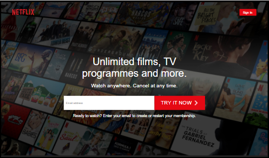
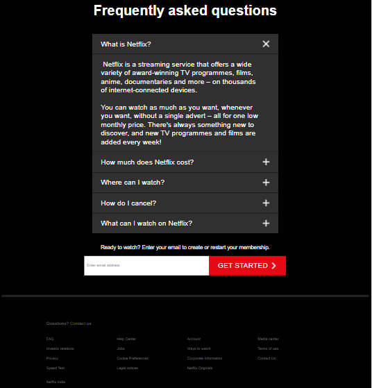
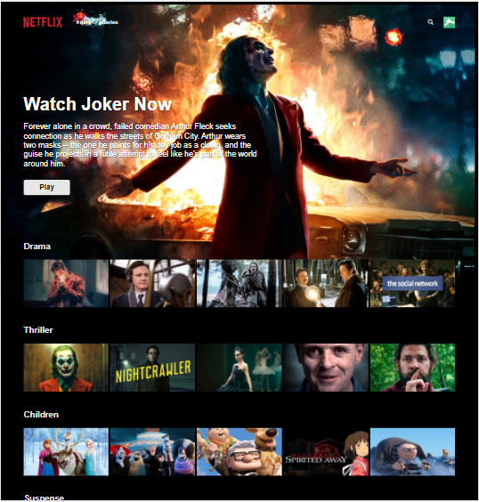
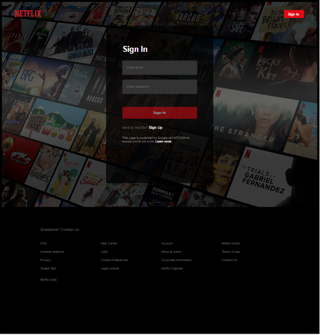

# netflix-clone

This is a Netflix clone created from scratch using react

Credits to Karl Hadwen's Youtube tutorial on the same.

This project uses : 

Compound components, Custom hooks, Context api, Firebase for auth and firestore for storage, styled components.

Learnt a lot from this tutorial. Thanks Karl!

### Home page

### Faq

### Browse

### SignIn

